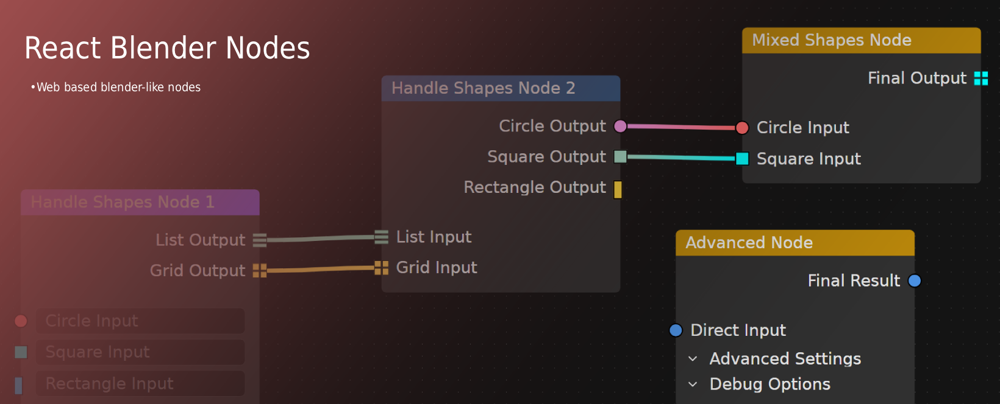
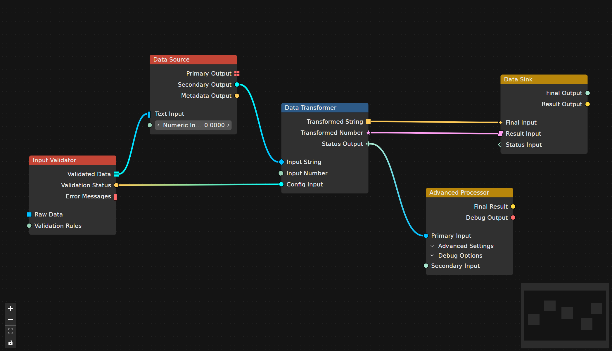
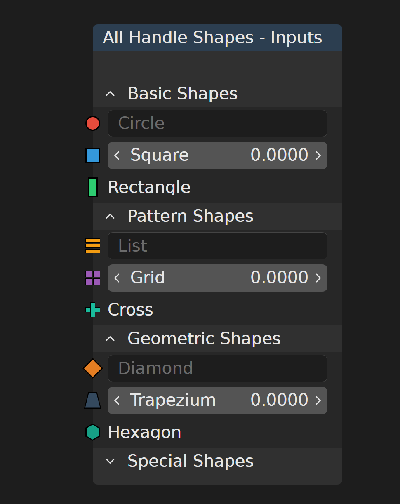
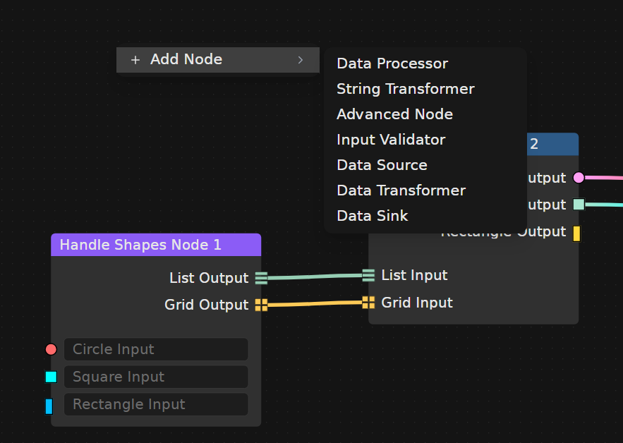

# React Blender Nodes

A React component library inspired by Blender's node editor interface, providing
a flexible and customizable node-based graph editor for web applications.



## Quick Links

- [](https://theclearsky.github.io/react-blender-nodes/?path=/story/components-organisms-fullgraph--playground) -
  Interactive examples and component playground
- [](https://www.npmjs.com/package/@theclearsky/react-blender-nodes) -
  Install and use in your project
- [](https://github.com/TheClearSky/react-blender-nodes/issues) -
  Report bugs and issues
- [](https://github.com/TheClearSky/react-blender-nodes/discussions) -
  Request features and discuss ideas

## Overview

React Blender Nodes recreates the iconic Blender node editor experience on the
web. Built with modern React patterns and TypeScript, it offers a complete
solution for creating interactive node-based interfaces with support for custom
nodes, connections, and real-time manipulation. Features an intelligent type
system with automatic inference, complex data validation, and comprehensive
connection validation to ensure your node graphs are always type-safe and
error-free.

## Quick Start

### Installation

```bash
npm install @theclearsky/react-blender-nodes
```

### Basic Usage

```tsx
import {
  FullGraph,
  useFullGraph,
  makeStateWithAutoInfer,
  makeTypeOfNodeWithAutoInfer,
  makeDataTypeWithAutoInfer,
} from 'react-blender-nodes';
import 'react-blender-nodes/style.css';

function MyNodeEditor() {
  // Define data types with auto-infer for type safety
  const dataTypes = {
    stringType: makeDataTypeWithAutoInfer({
      name: 'String',
      underlyingType: 'string',
      color: '#4A90E2',
    }),
    numberType: makeDataTypeWithAutoInfer({
      name: 'Number',
      underlyingType: 'number',
      color: '#7ED321',
    }),
  };

  // Define node types with auto-infer for type safety
  const typeOfNodes = {
    inputNode: makeTypeOfNodeWithAutoInfer({
      name: 'Input Node',
      headerColor: '#C44536',
      inputs: [
        { name: 'Text Input', dataType: 'stringType', allowInput: true },
        { name: 'Number Input', dataType: 'numberType', allowInput: true },
      ],
      outputs: [{ name: 'Output', dataType: 'stringType' }],
    }),
  };

  // Create state with auto-infer for complete type safety
  const initialState = makeStateWithAutoInfer({
    dataTypes,
    typeOfNodes,
    nodes: [],
    edges: [],
  });

  const { state, dispatch } = useFullGraph(initialState);

  return (
    <div style={{ height: '600px', width: '100%' }}>
      <FullGraph state={state} dispatch={dispatch} />
    </div>
  );
}
```

### Type Safety with Auto-Infer Helpers

The auto-infer helper functions are **essential** for type safety in React
Blender Nodes. They ensure TypeScript can properly validate type references
throughout your graph system:

- **`makeDataTypeWithAutoInfer`**: Validates data type definitions
- **`makeTypeOfNodeWithAutoInfer`**: Validates node type definitions and
  dataType references
- **`makeStateWithAutoInfer`**: Provides complete type inference for the entire
  state

**Why use them?**

- ✅ **Compile-time validation**: Catch errors before runtime
- ✅ **IDE support**: Better autocomplete and IntelliSense
- ✅ **Refactoring safety**: TypeScript ensures consistency when renaming types
- ✅ **Runtime safety**: Prevents invalid type references

**Without auto-infer helpers:**

```tsx
// ❌ No type validation - errors only caught at runtime
const dataTypes = {
  stringType: { name: 'String', underlyingType: 'string', color: '#4A90E2' },
};
```

**With auto-infer helpers:**

```tsx
// ✅ Full type validation - errors caught at compile time
const dataTypes = {
  stringType: makeDataTypeWithAutoInfer({
    name: 'String',
    underlyingType: 'string',
    color: '#4A90E2',
  }),
};
```

## Features

### 🎨 Blender-Inspired Interface



- Authentic dark theme matching Blender's node editor
- Familiar interactions and visual design
- Smooth animations and transitions

### 🔧 Customizable Nodes



- Dynamic inputs and outputs with custom shapes
- Collapsible input panels for complex configurations
- Interactive input components (text, number sliders)
- Custom handle shapes (circle, square, diamond, star, etc.)

### 🎮 Interactive Graph Editor



- Pan, zoom, and select nodes with intuitive controls
- Drag and drop node connections
- Context menu for adding new nodes
- Real-time node manipulation

### 🧠 Smart Type System & Validation + Advanced Features

https://github.com/user-attachments/assets/72d9384a-e9ca-4223-906a-dc422fb66f49

- **Intelligent Type Inference**: Automatically infer node types from
  connections
  - Dynamic type resolution as you build your graph
  - Real-time type updates when connections change
  - Support for `inferFromConnection` data types
- **Advanced Type Validation**: Comprehensive type checking system
  - **Complex Type Checking**: Zod schema validation for complex data structures
  - **Type Conversion Control**: Fine-grained control over allowed type
    conversions
  - **Cycle Detection**: Prevent infinite loops in your node graphs
- **Multiple Data Types**: Support for diverse data structures
  - Basic types: `string`, `number`
  - Complex types: Custom objects with Zod schemas
  - Special types: `inferFromConnection`, `noEquivalent`
- **Runtime Safety**: Catch type errors before they break your application
  - Connection validation with detailed error messages
  - Automatic type propagation across connected nodes
  - Schema compatibility checking for complex types
- **State Management**: Integrated reducer for managing graph state
- **TypeScript Support**: Full type safety with comprehensive definitions

## Usage Examples

### Smart Type System with Validation

```tsx
import { z } from 'zod';

// Define complex data types with Zod schemas
const userSchema = z.object({
  id: z.string(),
  name: z.string(),
  email: z.string().email(),
});

const dataTypes = {
  stringType: makeDataTypeWithAutoInfer({
    name: 'String',
    underlyingType: 'string',
    color: '#4A90E2',
  }),
  userType: makeDataTypeWithAutoInfer({
    name: 'User',
    underlyingType: 'complex',
    complexSchema: userSchema,
    color: '#7ED321',
  }),
  inferredType: makeDataTypeWithAutoInfer({
    name: 'Inferred',
    underlyingType: 'inferFromConnection',
    color: '#FF6B6B',
  }),
};

// Enable advanced validation features
const initialState = makeStateWithAutoInfer({
  dataTypes,
  typeOfNodes: {
    userInput: makeTypeOfNodeWithAutoInfer({
      name: 'User Input',
      inputs: [{ name: 'User Data', dataType: 'userType' }],
      outputs: [{ name: 'Output', dataType: 'inferredType' }],
    }),
    stringProcessor: makeTypeOfNodeWithAutoInfer({
      name: 'String Processor',
      inputs: [{ name: 'Input', dataType: 'inferredType' }],
      outputs: [{ name: 'Result', dataType: 'stringType' }],
    }),
  },
  nodes: [],
  edges: [],
  // Enable smart validation features
  enableTypeInference: true,
  enableComplexTypeChecking: true,
  enableCycleChecking: true,
  allowedConversionsBetweenDataTypes: {
    userType: { stringType: true }, // Allow user to string conversion
  },
});
```

### Custom Node with Panels

```tsx
const customNode = {
  id: 'advanced-node',
  type: 'configurableNode',
  position: { x: 100, y: 100 },
  data: {
    name: 'Advanced Processor',
    headerColor: '#2D5A87',
    inputs: [
      {
        id: 'direct-input',
        name: 'Direct Input',
        type: 'string',
        handleColor: '#00BFFF',
        allowInput: true,
      },
      {
        id: 'settings-panel',
        name: 'Settings Panel',
        inputs: [
          {
            id: 'threshold',
            name: 'Threshold',
            type: 'number',
            handleColor: '#96CEB4',
            allowInput: true,
            handleShape: 'diamond',
          },
          {
            id: 'config',
            name: 'Configuration',
            type: 'string',
            handleColor: '#00FFFF',
            allowInput: true,
            handleShape: 'star',
          },
        ],
      },
    ],
    outputs: [
      {
        id: 'result',
        name: 'Result',
        type: 'string',
        handleColor: '#FECA57',
        handleShape: 'hexagon',
      },
    ],
  },
};
```

### Handle Shapes Showcase

```tsx
// Available handle shapes
const handleShapes = [
  'circle', // Default circular handle
  'square', // Square handle
  'rectangle', // Tall rectangle
  'diamond', // 45° rotated square
  'hexagon', // Regular hexagon
  'star', // 5-pointed star
  'cross', // Plus/cross shape
  'list', // Three horizontal bars
  'grid', // 2x2 grid of squares
  'trapezium', // Trapezoid shape
  'zigzag', // Zigzag pattern
  'sparkle', // Sparkle effect
  'parallelogram', // Parallelogram shape
];
```

### Context Menu Integration

```tsx
// Right-click anywhere on the graph to open context menu
// Automatically generates "Add Node" menu with all available node types
// Clicking a node type adds it at the cursor position
```

## 🎨 Styling

The library uses Tailwind CSS for styling and provides a dark theme that matches
Blender's aesthetic:

```css
/* Import the default styles */
@import 'react-blender-nodes/style.css';

/* Customize colors using CSS variables */
:root {
  --primary-black: #181818;
  --primary-dark-gray: #272727;
  --primary-gray: #3f3f3f;
  --primary-white: #ffffff;
}
```

## 📚 Documentation

### Interactive Documentation

Explore all components with live examples:

```bash
npm run storybook
```

Visit `http://localhost:6006` to see:

- Component playgrounds
- Interactive controls
- Usage examples
- Handle shape demonstrations

### Component API

#### FullGraph

The main graph editor component with full ReactFlow integration.

```tsx
interface FullGraphProps {
  state: State;
  dispatch: Dispatch;
}
```

#### ConfigurableNode

Customizable node component with dynamic inputs and outputs.

```tsx
interface ConfigurableNodeProps {
  name?: string;
  headerColor?: string;
  inputs?: (ConfigurableNodeInput | ConfigurableNodeInputPanel)[];
  outputs?: ConfigurableNodeOutput[];
  isCurrentlyInsideReactFlow?: boolean;
}
```

## 🔗 Links

- [📖 Storybook Documentation](https://theclearsky.github.io/react-blender-nodes/?path=/story/components-organisms-fullgraph--playground)
- [📦 NPM Package](https://www.npmjs.com/package/@theclearsky/react-blender-nodes)
- [🐛 Report Issues](https://github.com/TheClearSky/react-blender-nodes/issues)
- [💡 Request Features](https://github.com/TheClearSky/react-blender-nodes/discussions)

## 🤝 Contributing

We welcome contributions! Please see our [Contributing Guide](./CONTRIBUTING.md)
for details on:

- Setting up the development environment
- Code style and conventions
- Submitting pull requests
- Reporting issues

## 📄 License

MIT License - see [LICENSE](./LICENSE) for details.

## 🙏 Acknowledgments

- **Blender Foundation**: For creating the amazing Blender software that
  inspired this project
- **ReactFlow**: For providing the foundation for the graph editor functionality
- **Shadcn/ui**: For the component design system and utilities

> **Note**: This project is not affiliated with Blender Foundation. If you find
> Blender useful, consider
> [donating to support their work](https://fund.blender.org/).

---

Made with ❤️ for the Blender and React communities
