<p align="center">
  
</p>
<h1 align="center">react-blender-nodes</h1>
<p align="center">
  A React component library inspired by Blender's node editor interface, providing<br/>
  a flexible and customizable node-based graph editor for web applications.
</p>

> **Note**: This project is not affiliated with Blender Foundation. If you find
> Blender useful, consider
> [donating to support their work](https://fund.blender.org/).

<p align="center">
  <a href="https://bundlejs.com/?q=%40theclearsky%2Freact-blender-nodes"></a>
</p>

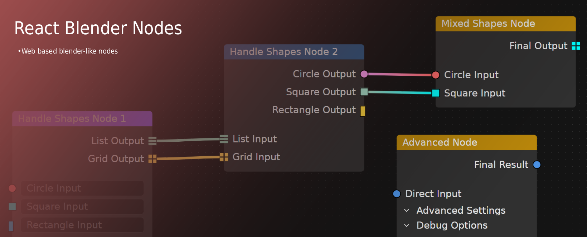

## How these projects fit together

This library sits at the heart of a small family of projects: two plugins build
on it, and a full application shows what it can do.

```text
                react-blender-nodes  ·  MIT  ·  published
                            T H E   E N G I N E
     ┌────────────────────────────────────────────────────────────┐
     │  ◀── this package                                          │
     │  A Blender-style node-graph editor for React.              │
     │  Typed handles · validate → plan → apply state · node      │
     │  groups · loops & switches · graph compiler + runner ·     │
     │  import / export                                           │
     └──────┬──────────────────────┬────────────────────────┬─────┘
            │                      │                        │
            │ peerDependency       │ peerDependency         │ file:
            │ >=0.0.14 <1          │ >=0.0.14 <1            │ dependency
            │                      │ (via /contract —       │
            ▼                      ▼  React-free)           │
  ┌──────────────────────┐  ┌──────────────────────┐        │
  │ …-timeline           │  │ …-codegen            │        │
  │ AGPL-3.0 · published │  │ AGPL-3.0 · published │        │
  ├──────────────────────┤  ├──────────────────────┤        │
  │ Keyframed CURVES and │  │ Compiles a graph into│        │
  │ a transport. A curve │  │ a standalone,        │        │
  │ becomes a live signal│  │ dependency-free      │        │
  │ the running graph    │  │ runGraph module.     │        │
  │ can read.            │  │ No React at runtime. │        │
  └──────────┬───────────┘  └──────────────────────┘        │
             │                                              │
             │ file: dependency                             │
             └───────────────────┬──────────────────────────┘
                                 ▼
     ┌────────────────────────────────────────────────────────────┐
     │  react-blender-nodes-sound  ·  AGPL-3.0  ·  app            │
     │                  T H E   A P P L I C A T I O N             │
     ├────────────────────────────────────────────────────────────┤
     │  Here the nodes ARE the audio graph (Tone.js / Web Audio): │
     │  draw a waveform and hear it · gate-driven envelopes ·     │
     │  16-key polyphony · timeline curves automating any         │
     │  parameter while it plays · a spectrally-modelled          │
     │  instrument library                                        │
     └────────────────────────────────────────────────────────────┘
```

An arrow points from a package **to the package that depends on it**. This
library stays MIT so anyone can build on it; the plugins and the app are
AGPL-3.0-only. The two plugins never import each other — the app is the only
place they meet.

## Quick Links

- [](https://theclearsky.github.io/react-blender-nodes/?path=/story/organisms-fullgraph--with-runner) -
  Interactive examples and component playground
- [](https://www.npmjs.com/package/@theclearsky/react-blender-nodes) -
  Install and use in your project
- [](https://github.com/TheClearSky/react-blender-nodes/issues) -
  Report bugs and issues
- [](https://github.com/TheClearSky/react-blender-nodes/discussions) -
  Request features and discuss ideas

## Overview

React Blender Nodes recreates the iconic Blender node editor experience on the
web. Built with modern React patterns and TypeScript, it offers a complete
solution for creating interactive node-based interfaces with support for custom
nodes, connections, and real-time manipulation. Features an intelligent type
system with automatic inference, complex data validation, and comprehensive
connection validation to ensure your node graphs are always type-safe and
error-free.

Beyond editing, the library can **execute** your graphs with a built-in runner
and timeline debugger — or hand them to pluggable **run targets**, including a
separate AGPL-3.0-only codegen plugin that compiles them to standalone
JavaScript/TypeScript — compose reusable **node groups**, build control flow
with first-class **loops** and **switches** (rendered as visual zones), edit
those structures and node types through in-canvas **drawers**, and step backward
and forward through every change with full **undo/redo** history. Graph state
and execution recordings can be exported to and imported from JSON.

## Quick Start

### Installation

```bash
npm install @theclearsky/react-blender-nodes
```

### Basic Usage

```tsx
import {
  FullGraph,
  useFullGraph,
  makeStateWithAutoInfer,
  makeTypeOfNodeWithAutoInfer,
  makeDataTypeWithAutoInfer,
} from '@theclearsky/react-blender-nodes';
import '@theclearsky/react-blender-nodes/style.css';

function MyNodeEditor() {
  // Define data types with auto-infer for type safety
  const dataTypes = {
    stringType: makeDataTypeWithAutoInfer({
      name: 'String',
      underlyingType: 'string',
      color: '#4A90E2',
    }),
    numberType: makeDataTypeWithAutoInfer({
      name: 'Number',
      underlyingType: 'number',
      color: '#7ED321',
    }),
  };

  // Define node types with auto-infer for type safety
  const typeOfNodes = {
    inputNode: makeTypeOfNodeWithAutoInfer({
      name: 'Input Node',
      headerColor: '#C44536',
      inputs: [
        { name: 'Text Input', dataType: 'stringType', allowInput: true },
        { name: 'Number Input', dataType: 'numberType', allowInput: true },
      ],
      outputs: [{ name: 'Output', dataType: 'stringType' }],
    }),
  };

  // Create state with auto-infer for complete type safety
  const initialState = makeStateWithAutoInfer({
    dataTypes,
    typeOfNodes,
    nodes: [],
    edges: [],
  });

  const { state, dispatch } = useFullGraph(initialState);

  return (
    <div style={{ height: '600px', width: '100%' }}>
      <FullGraph state={state} dispatch={dispatch} />
    </div>
  );
}
```

### Type Safety with Auto-Infer Helpers

The auto-infer helper functions are **essential** for type safety in React
Blender Nodes. They ensure TypeScript can properly validate type references
throughout your graph system:

- **`makeDataTypeWithAutoInfer`**: Validates data type definitions
- **`makeTypeOfNodeWithAutoInfer`**: Validates node type definitions and
  dataType references
- **`makeStateWithAutoInfer`**: Provides complete type inference for the entire
  state

**Why use them?**

- ✅ **Compile-time validation**: Catch errors before runtime
- ✅ **IDE support**: Better autocomplete and IntelliSense
- ✅ **Refactoring safety**: TypeScript ensures consistency when renaming types
- ✅ **Runtime safety**: Prevents invalid type references

**Without auto-infer helpers:**

```tsx
// ❌ No type validation - errors only caught at runtime
const dataTypes = {
  stringType: { name: 'String', underlyingType: 'string', color: '#4A90E2' },
};
```

**With auto-infer helpers:**

```tsx
// ✅ Full type validation - errors caught at compile time
const dataTypes = {
  stringType: makeDataTypeWithAutoInfer({
    name: 'String',
    underlyingType: 'string',
    color: '#4A90E2',
  }),
};
```

## Features

### 🎨 Blender-Inspired Interface

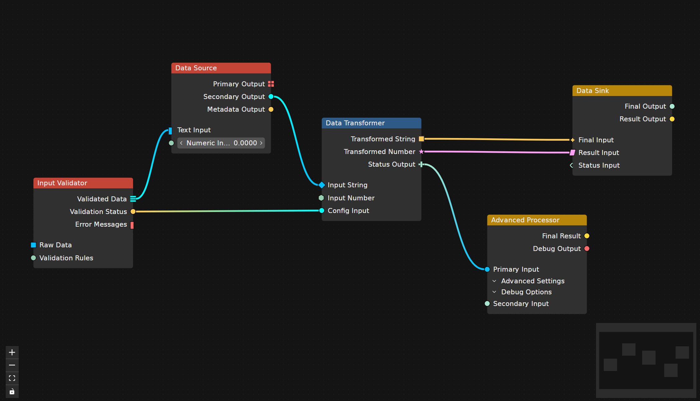

- Authentic dark theme matching Blender's node editor
- Familiar interactions and visual design
- Smooth animations and transitions

### 🔧 Customizable Nodes

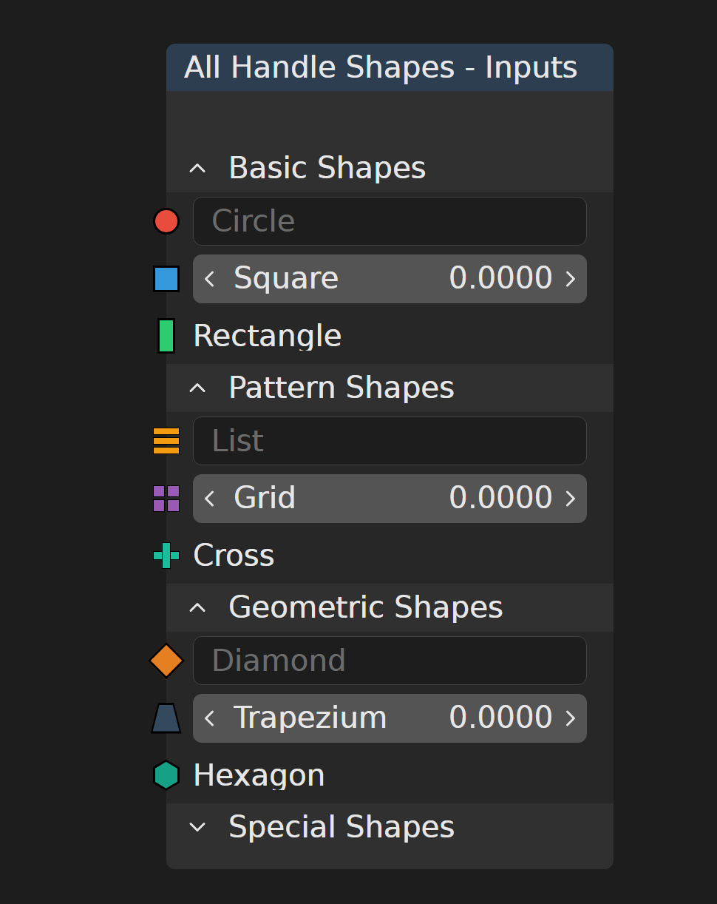

- Dynamic inputs and outputs with custom shapes
- Collapsible input panels for complex configurations
- Interactive input components (text, number sliders)
- Custom handle shapes (circle, square, diamond, star, etc.)

### 🎮 Interactive Graph Editor

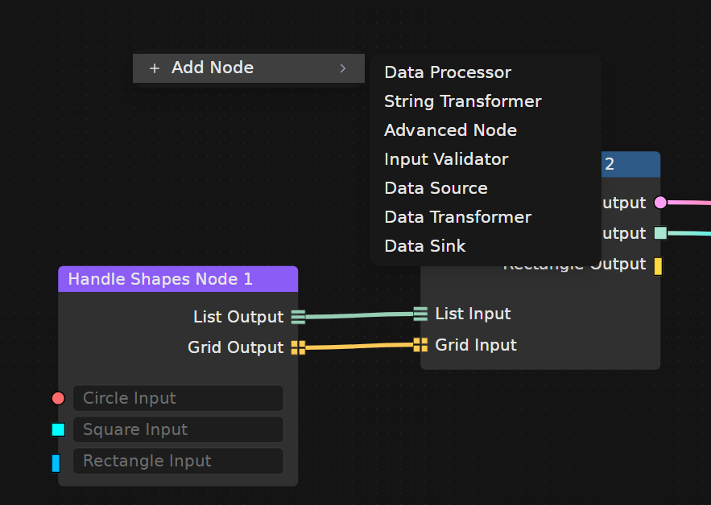

- Pan, zoom, and select nodes with intuitive controls
- Drag and drop node connections
- Context menu for adding new nodes
- Real-time node manipulation

### 🧠 Smart Type System & Validation + Advanced Features

https://github.com/user-attachments/assets/72d9384a-e9ca-4223-906a-dc422fb66f49

- **Intelligent Type Inference**: Automatically infer node types from
  connections
  - Dynamic type resolution as you build your graph
  - Real-time type updates when connections change
  - Support for `inferFromConnection` data types
- **Advanced Type Validation**: Comprehensive type checking system
  - **Complex Type Checking**: Zod schema validation for complex data structures
  - **Type Conversion Control**: Fine-grained control over allowed type
    conversions
  - **Cycle Detection**: Prevent infinite loops in your node graphs
- **Multiple Data Types**: Support for diverse data structures
  - Basic types: `string`, `number`, `boolean`
  - Complex types: Custom objects with Zod schemas
  - Special types: `inferFromConnection`, `noEquivalent`
- **Runtime Safety**: Catch type errors before they break your application
  - Connection validation with detailed error messages
  - Automatic type propagation across connected nodes
  - Schema compatibility checking for complex types
- **State Management**: Integrated reducer for managing graph state
- **TypeScript Support**: Full type safety with comprehensive definitions

### 🚀 Node Runner — Execute Your Graphs

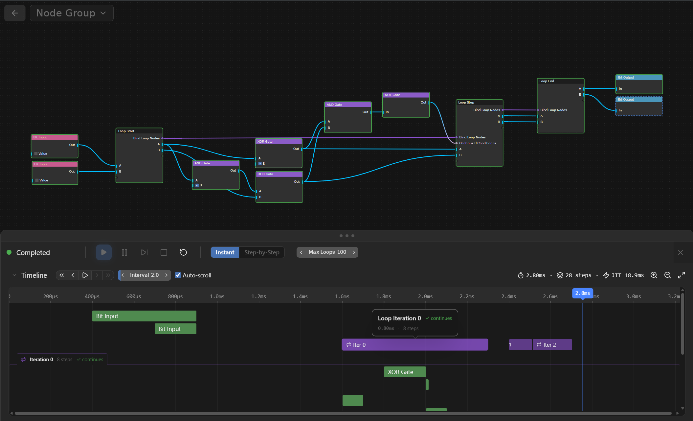

Turn your node graphs into executable programs. The built-in runner compiles
your graph into an execution plan and runs it — with full debugging support.

- **Two execution modes**:
  - **Instant**: Runs the entire graph at once, then replay via the timeline
  - **Step-by-step**: Pause after each node, manually advance with step/resume
- **Execution timeline**: Multi-track timeline visualization showing each node's
  execution as a block, grouped by concurrency level
  - Scrubber with drag-to-seek and snap-to-step
  - Zoom, pan, and auto-fit controls
  - Wall-clock and execution-time display modes (strips out pause/debug
    overhead)
  - Auto-scroll follows the current step during live execution
- **Step inspector**: Click any timeline block to inspect a step's input values,
  output values, timing, errors, and loop/group context
- **Visual node states**: Nodes on the canvas highlight in real time as idle,
  running, completed, skipped, or errored

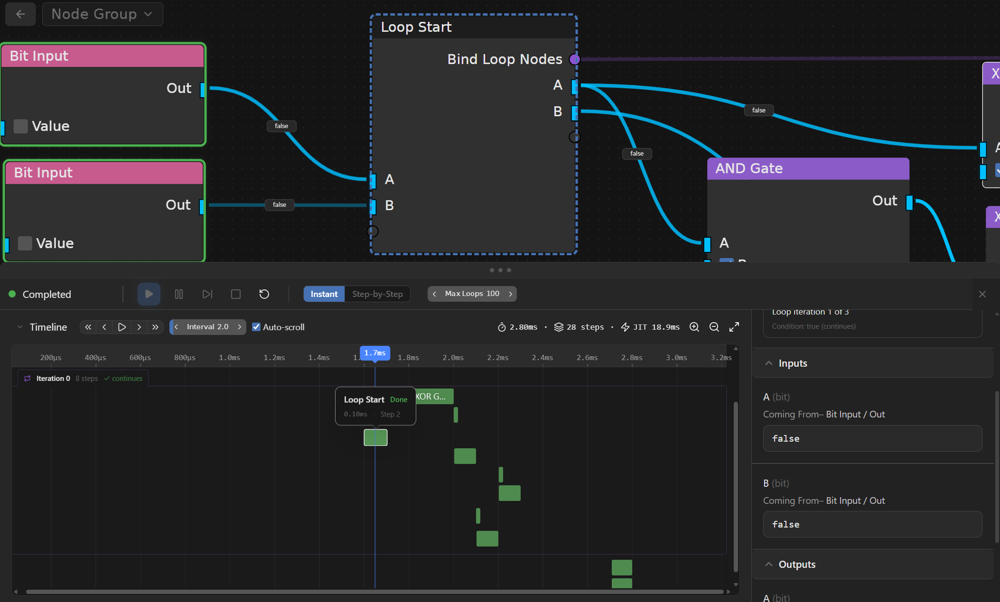

- **Loop support**: Define iterative computation with loop-start/stop/end node
  triplets — the runner compiles loop bodies into `LoopExecutionBlock`s with
  per-iteration recording and configurable max-iteration limits
- **Node groups**: Compose subgraphs into reusable group nodes — the compiler
  recursively resolves group subtrees into `GroupExecutionScope`s
- **Execution recording**: Every run produces a full `ExecutionRecord` with
  per-step timing, input/output snapshots, and loop iteration details — export
  and import recordings as JSON for sharing and offline analysis

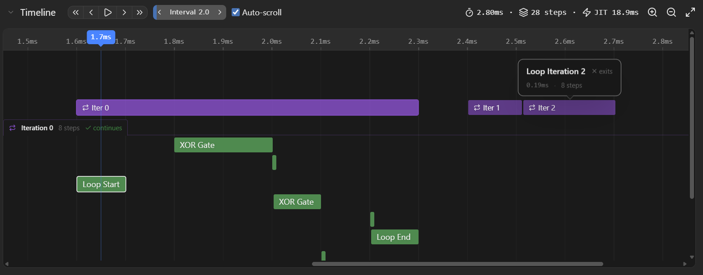

### ⚡ Codegen & Pluggable Run Targets — Export Your Graph as Code

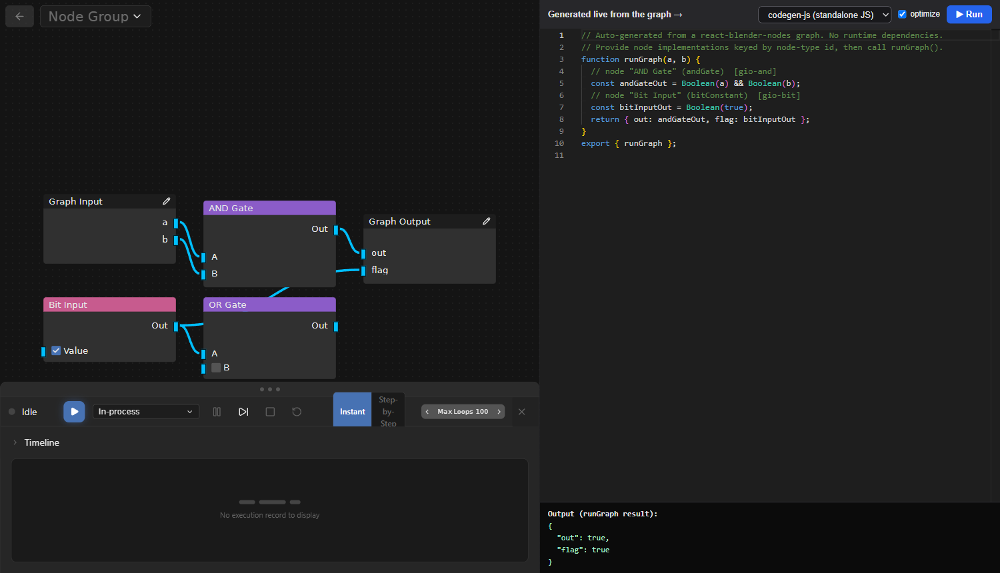

The in-process runner is just the default **run target**. The Run button is a
split control: register your own named targets, use the built-in
`jsonIrRunTarget` to export the execution plan as a JSON intermediate
representation, or install the **separate codegen plugin** to compile a graph
into a **standalone, dependency-free function** — `runGraph(...)` — in
JavaScript or typed TypeScript.

- **Export as code (plugin)**: `codegenJsRunTarget` / `codegenTsRunTarget` from
  [`@theclearsky/react-blender-nodes-codegen`](https://github.com/TheClearSky/react-blender-nodes-codegen)
  (AGPL-3.0-only, published separately) emit a self-contained `runGraph()` (TS
  adds typed parameters, a return type, and value casts). Built into this
  package: `jsonIrRunTarget` exports the execution plan as JSON, and the default
  `inProcessRunTarget` runs the graph live and feeds the timeline.
- **Clean signature from Graph I/O**: declare root **Graph Input** / **Graph
  Output** nodes and their handle names become the function's parameters and
  returned-object keys — an all-inlined graph compiles to a tidy
  `function runGraph(a, b) { … return { out, flag }; }` with no plumbing
  arguments.
- **Opt-in optimization passes**: by default the codegen targets emit a
  faithful, threaded `runGraph`. Enable the codegen-v2 passes per target to get
  the clean output — `assumePureImplementations` runs dead-code elimination
  (drops branches no output depends on); unconnected inputs always inline their
  current value; and `analyzeImplementations` makes value-API nodes whose
  implementation reads inputs through the exported `readInput` intrinsic
  **auto-emit inline as expressions** instead of threading through an
  implementations argument.
- **Pluggable contract**: a `RunTarget` is either an `execute` target (produces
  an `ExecutionRecord`, drives the timeline, and may support stepping) or an
  `artifact` target (produces a string/download). Register them via the
  `runTargets` prop and pick the default with `defaultRunTargetId`.

```tsx
import { FullGraph, jsonIrRunTarget } from '@theclearsky/react-blender-nodes';
// Code generation is a separate, AGPL-3.0-only plugin:
import {
  codegenJsRunTarget,
  codegenTsRunTarget,
} from '@theclearsky/react-blender-nodes-codegen';

// The Run button becomes a split control listing every registered target.
<FullGraph
  state={state}
  dispatch={dispatch}
  functionImplementations={functionImplementations}
  runTargets={[codegenJsRunTarget, codegenTsRunTarget, jsonIrRunTarget]}
/>;
```

### 🔁 Loops, 🔀 Switches & Zones

Build control flow directly on the canvas. Loops and switches are first-class
structures backed by dedicated standard nodes, and each renders as a labelled
**zone** — a frame polygon drawn around the nodes it contains.

- **Loops**: Drop a loop-start / loop-stop / loop-end node triplet to define an
  iterative body. The runner compiles the body into a `LoopExecutionBlock` and
  records every iteration, with a configurable max-iteration safety limit.
- **Switches**: A switch-start / switch-end pair routes execution down a `true`
  or `false` branch based on a condition handle. The compiler resolves the taken
  branch and skips the other, surfacing skipped nodes on the canvas.
- **Zones**: System zones are created and re-discovered automatically as you add
  structures or change connections. Each zone tracks the body nodes inside it
  and can enforce connection boundaries (blocking edges that cross in or out).
  Zones are scope-local, so structures inside a node group get their own zones.
- **Nesting**: Loops, switches, and groups can be nested inside one another;
  zone discovery and the compiler resolve nested structures recursively.

### 🪟 In-Canvas Editors

Structures and node types are edited through slide-out drawers, dispatched via
the graph state and tracked on `state.activeDrawer`:

- **Node Type editor** (`editNodeType`): rename a node type, change its header
  color, and add, remove, or reorder its inputs and outputs.
- **Loop editor** (`editLoop`): configure the handles carried through the loop
  triplet, organized into levels.
- **Switch editor** (`editSwitch`): configure the handles carried through the
  switch pair across its true/false branches.
- **Graph I/O editor** (`editGraphInput` / `editGraphOutput`): rename, reorder,
  add, or delete the handles of a root **Graph Input / Output** node — the
  graph's I/O boundary, whose handle names define the `runGraph(...)` signature
  used by codegen.

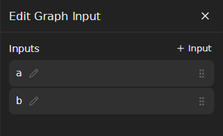

The Node Type / Node Group editor (`editNodeType`) edits a type's name, header
color, and its full input/output list — including grouping handles into
collapsible **panels** and drag-reordering them:

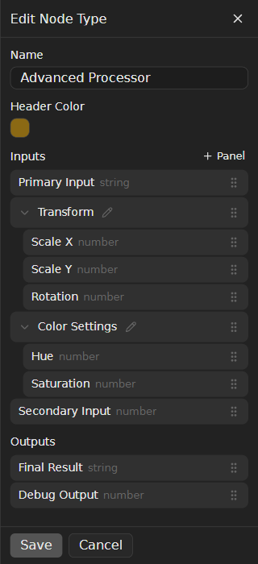

Deleting a handle or channel that carries connections opens a **deletion
review** — it previews exactly which connections would break (with an expandable
mini-map highlighting them) and lets you include or exclude each deletion before
committing:

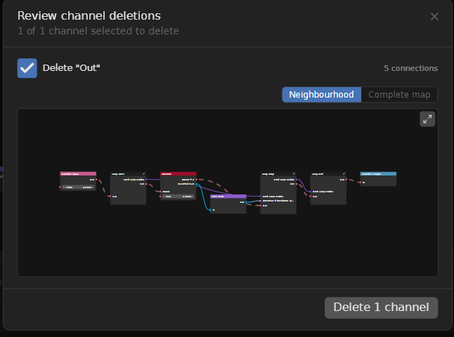

### ↩️ Undo / Redo History

Every structural edit is recorded in an Immer-patch-based undo/redo history, so
users can freely step backward and forward.

- **Patch-based**: history stores forward and inverse Immer patches per entry —
  compact and exact, with a configurable `maxSize`.
- **Smart undoability**: viewport changes, navigation, drawer open/close, and
  selection-only ReactFlow updates are intentionally _not_ recorded.
- **Batching**: `BEGIN_BATCH` / `END_BATCH` collapse a sequence of related edits
  (e.g. a multi-node drag) into a single undo step.
- **Keyboard shortcuts**: `<FullGraph>` listens for `Ctrl+Z` / `Ctrl+Shift+Z` /
  `Ctrl+Y` by default (toggle with `enableUndoRedoShortcuts`).
- **Serializable**: history can be exported and re-imported alongside graph
  state (non-serializable patch values such as Zod schemas are stripped).

### 📡 Graph Event Stream

For tests, dev tooling, and telemetry, subscribe to a single unified
observability stream via `onGraphEvent`. Reducer-layer events (`action:applied`
/ `action:rejected` / `state:committed`) carry typed payloads (e.g. an
`action:rejected` event carries the original `ValidationError` so you can switch
on `.code`), and UI-layer events (`ui:drag:ended` / `ui:delete:attempted` /
`ui:state:imported` / `ui:recording:imported`) cover moments that bypass the
reducer. Pass the _same_ handler to both
`useFullGraph(initialState, { onGraphEvent })` and
`<FullGraph onGraphEvent={...} />` to receive every event.

### Usage

```tsx
import {
  FullGraph,
  useFullGraph,
  makeFunctionImplementationsWithAutoInfer,
} from '@theclearsky/react-blender-nodes';

// Define what each node type does when executed.
// An implementation receives positional args: (inputs, outputs, context).
// `inputs` is a ReadonlyMap keyed by handle *name*; read a connected value
// via inputs.get('Name')?.connections[0]?.value. Return a Map of output
// handle *names* to computed values (sync Map or Promise<Map>).
const functionImplementations = makeFunctionImplementationsWithAutoInfer({
  myNodeType: async (inputs) => {
    const value = Number(inputs.get('Input')?.connections[0]?.value ?? 0);
    return new Map([['Output', value * 2]]);
  },
});

function MyExecutableGraph() {
  const { state, dispatch } = useFullGraph(initialState);

  // Pass implementations to FullGraph to enable the runner
  return (
    <FullGraph
      state={state}
      dispatch={dispatch}
      functionImplementations={functionImplementations}
    />
  );
}
```

### Controlling execution

Execution is driven through `FullGraph`'s runner props — the runner hook itself
(`useNodeRunner`) is internal to `FullGraph` and is not exported. Register run
targets, pick the default, seed the root Graph Input, and observe or control the
execution record:

```tsx
import { useState } from 'react';
import {
  FullGraph,
  useFullGraph,
  jsonIrRunTarget,
  type ExecutionRecord,
} from '@theclearsky/react-blender-nodes';

function MyExecutableGraph() {
  const { state, dispatch } = useFullGraph(initialState);
  const [record, setRecord] = useState<ExecutionRecord | undefined>();

  return (
    <FullGraph
      state={state}
      dispatch={dispatch}
      functionImplementations={functionImplementations}
      runTargets={[jsonIrRunTarget]} // the Run button becomes a split control
      rootInputs={{ a: 2, b: 3 }} // seeds the root Graph Input by handle name (or id)
      executionRecord={record} // controlled record — you own its lifecycle
      onExecutionRecordChange={setRecord}
    />
  );
}
```

For headless use — CI checks, tooling, or inspecting what the runner will do —
compile a graph directly and serialize the plan:

```ts
import {
  compile,
  serializeExecutionPlan,
} from '@theclearsky/react-blender-nodes';

const plan = compile(state, functionImplementations, {
  maxLoopIterations: 100,
});
console.log(JSON.stringify(serializeExecutionPlan(plan), null, 2));
```

### Import/Export & Automatic Repair

Graph state and execution recordings can be exported to JSON and re-imported
later. On import, the library validates the structure and can automatically
repair common issues via opt-in repair strategies.

#### State Import Repair Strategies

Pass a `repair` object to `importGraphState` to enable automatic fixes:

```tsx
import { importGraphState } from '@theclearsky/react-blender-nodes';

const result = importGraphState(json, {
  dataTypes: myDataTypes,
  typeOfNodes: myTypeOfNodes,
  repair: {
    removeOrphanEdges: true, // Remove edges whose source or target node doesn't exist
    removeDuplicateNodeIds: true, // Deduplicate nodes with the same ID (keep first)
    removeDuplicateEdgeIds: true, // Deduplicate edges with the same ID (keep first)
    fillMissingDefaults: true, // Fill missing optional fields (viewport, etc.) with defaults
    rehydrateDataTypeObjects: true, // Effectively always-on — the importer always rebuilds handle dataType objects from provided dataTypes (this flag is not read)
    normalizeConnectionOrder: true, // Repack imported fan-in connection orders to contiguous 0..n-1
  },
});

if (result.success) {
  // result.data is the repaired State
  // result.warnings contains info about what was repaired
} else {
  // result.errors contains fatal validation issues
}
```

#### Recording Import Repair Strategies

Pass a `repair` object to `importExecutionRecord` for recording-specific fixes:

```tsx
import { importExecutionRecord } from '@theclearsky/react-blender-nodes';

const result = importExecutionRecord(json, {
  repair: {
    sanitizeNonSerializableValues: true, // No-op — values parsed from JSON are already serializable; kept for API symmetry
    removeOrphanSteps: true, // Remove malformed steps missing nodeId, nodeTypeId, or stepIndex
  },
});
```

All repair strategies default to `false` and must be explicitly enabled.

## Usage Examples

### Smart Type System with Validation

```tsx
import { z } from 'zod';

// Define complex data types with Zod schemas
const userSchema = z.object({
  id: z.string(),
  name: z.string(),
  email: z.string().email(),
});

const dataTypes = {
  stringType: makeDataTypeWithAutoInfer({
    name: 'String',
    underlyingType: 'string',
    color: '#4A90E2',
  }),
  userType: makeDataTypeWithAutoInfer({
    name: 'User',
    underlyingType: 'complex',
    complexSchema: userSchema,
    color: '#7ED321',
  }),
  inferredType: makeDataTypeWithAutoInfer({
    name: 'Inferred',
    underlyingType: 'inferFromConnection',
    color: '#FF6B6B',
  }),
};

// Enable advanced validation features
const initialState = makeStateWithAutoInfer({
  dataTypes,
  typeOfNodes: {
    userInput: makeTypeOfNodeWithAutoInfer({
      name: 'User Input',
      inputs: [{ name: 'User Data', dataType: 'userType' }],
      outputs: [{ name: 'Output', dataType: 'inferredType' }],
    }),
    stringProcessor: makeTypeOfNodeWithAutoInfer({
      name: 'String Processor',
      inputs: [{ name: 'Input', dataType: 'inferredType' }],
      outputs: [{ name: 'Result', dataType: 'stringType' }],
    }),
  },
  nodes: [],
  edges: [],
  // Enable smart validation features
  enableTypeInference: true,
  enableComplexTypeChecking: true,
  enableCycleChecking: true,
  allowedConversionsBetweenDataTypes: {
    userType: { stringType: true }, // Allow user to string conversion
  },
});
```

### Custom Node with Panels

```tsx
const customNode = {
  id: 'advanced-node',
  type: 'configurableNode',
  position: { x: 100, y: 100 },
  data: {
    name: 'Advanced Processor',
    headerColor: '#2D5A87',
    inputs: [
      {
        id: 'direct-input',
        name: 'Direct Input',
        type: 'string',
        handleColor: '#00BFFF',
        allowInput: true,
      },
      {
        id: 'settings-panel',
        name: 'Settings Panel',
        inputs: [
          {
            id: 'threshold',
            name: 'Threshold',
            type: 'number',
            handleColor: '#96CEB4',
            allowInput: true,
            handleShape: 'diamond',
          },
          {
            id: 'config',
            name: 'Configuration',
            type: 'string',
            handleColor: '#00FFFF',
            allowInput: true,
            handleShape: 'star',
          },
        ],
      },
    ],
    outputs: [
      {
        id: 'result',
        name: 'Result',
        type: 'string',
        handleColor: '#FECA57',
        handleShape: 'hexagon',
      },
    ],
  },
};
```

### Handle Shapes Showcase

```tsx
// Available handle shapes
const handleShapes = [
  'circle', // Default circular handle
  'square', // Square handle
  'rectangle', // Tall rectangle
  'diamond', // 45° rotated square
  'hexagon', // Regular hexagon
  'star', // 5-pointed star
  'cross', // Plus/cross shape
  'list', // Three horizontal bars
  'grid', // 2x2 grid of squares
  'trapezium', // Trapezoid shape
  'zigzag', // Zigzag pattern
  'sparkle', // Sparkle effect
  'parallelogram', // Parallelogram shape
];
```

### Context Menu Integration

```tsx
// Right-click anywhere on the graph to open context menu
// Automatically generates "Add Node" menu with all available node types
// Clicking a node type adds it at the cursor position
```

## 🎨 Styling & Theming

The whole graph — canvas, nodes, handles, menus, runner panel, timeline, and the
in-canvas editor drawers — is retheme-able from a single typed theme object.
Below: the same graph under the built-in path plus two custom presets (a
cyberpunk "Neon Heist" and a comic "Halftone Pop") — nodes, edges, run button,
background grid, and accents all follow the active theme.

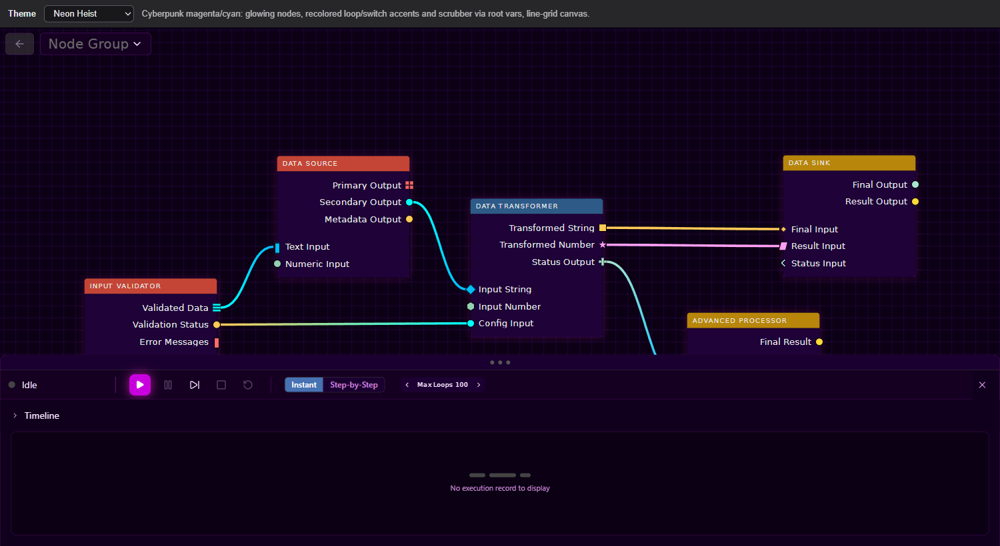

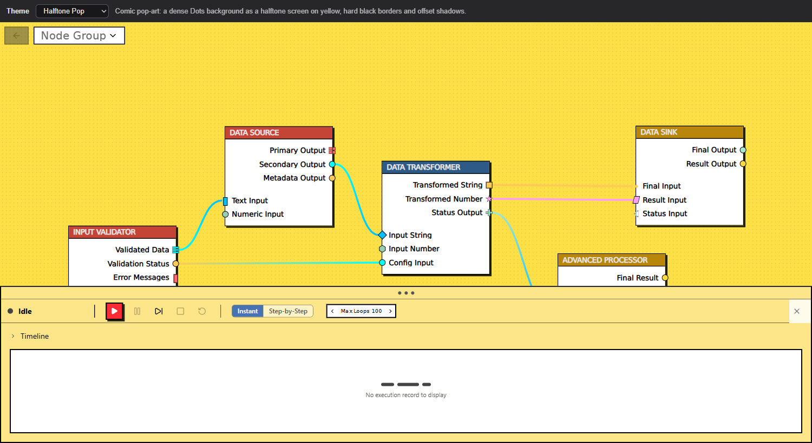

Import the stylesheet once; the graph ships with the default Blender-style dark
look:

```css
@import '@theclearsky/react-blender-nodes/style.css';
```

To retheme the graph, wrap it in the optional `GraphThemeProvider` — a theme is
a typed map of per-component/per-slot Tailwind className overrides plus a
`reactFlow` section, deep-merged over a named preset (`'blenderDark'` |
`'light'`):

```tsx
import {
  FullGraph,
  GraphThemeProvider,
} from '@theclearsky/react-blender-nodes';

<GraphThemeProvider preset='light' theme={{ node: { header: 'rounded-none' } }}>
  <FullGraph state={state} dispatch={dispatch} />
</GraphThemeProvider>;
```

Without a provider the graph keeps its default look — theming is purely
additive. The built-in presets work out of the box (their classes ship in
`style.css`); classes you write yourself need your own Tailwind v4 build
scanning the files that contain them. Var-driven surfaces (scrollbars, glows,
timeline accents) are recolored through CSS variables on the `root` slot, e.g.
`theme={{ root: '[--color-graph-menu-bg:#f5f5f5]' }}` — re-declaring the
`@theme inline` tokens from your own CSS does NOT restyle the pre-built
stylesheet (those utilities inline their values at build time). See
[docs/ui/themingDoc.md](docs/ui/themingDoc.md) for the full slot map, the three
theming mechanisms, and the portal caveats.

## 📚 Documentation

### Interactive Documentation

Explore all components with live examples:

```bash
npm run storybook
```

Visit `http://localhost:6006` to see:

- Component playgrounds
- Interactive controls
- Usage examples
- Handle shape demonstrations

### Architecture & Internal Documentation

For contributors and developers building on the library internals, a full
documentation index is available at [`docs/index.md`](./docs/index.md). It
includes an ASCII architecture diagram, cross-feature dependency maps, and a
**"What to Read Based on What You're Building"** guide:

| Task                         | Key Docs                                                                    |
| ---------------------------- | --------------------------------------------------------------------------- |
| Adding a new data type       | `dataTypesDoc`, `handlesDoc`, `typeInferenceDoc`, `connectionValidationDoc` |
| Adding a new node type       | `nodesDoc`, `handlesDoc`, `configurableNodeDoc`, `stateManagementDoc`       |
| Making nodes executable      | `runnerCompilerDoc`, `runnerExecutorDoc`, `runnerHookDoc`                   |
| Building node groups / loops | `nodeGroupsDoc`, `loopsDoc`, `connectionValidationDoc`                      |
| Modifying graph editor UI    | `fullGraphDoc`, `configurableNodeDoc`, `contextMenuDoc`                     |
| Working with state/reducer   | `stateManagementDoc`, `immerDoc`, `edgesDoc`                                |

See the [full index](./docs/index.md) for all 39 documentation files with
relative links organized by tier.

### Component API

#### FullGraph

The main graph editor component with full ReactFlow integration.

```tsx
interface FullGraphProps {
  /** The current state of the graph including nodes, edges, and type definitions */
  state: State;
  /** Dispatch function for updating the graph state */
  dispatch: Dispatch;
  /** Function implementations for each node type, enables the runner when provided */
  functionImplementations?: FunctionImplementations;
  /** Called when state is successfully imported. Receives the raw parsed state. */
  onStateImported?: (importedState: State) => void;
  /** Called when a recording is successfully imported. Receives the parsed ExecutionRecord. */
  onRecordingImported?: (record: ExecutionRecord) => void;
  /** Called when import validation fails. Receives the error messages. */
  onImportError?: (errors: string[]) => void;
  /** Controlled execution record. When provided, FullGraph uses this instead of internal state. */
  executionRecord?: ExecutionRecord | null;
  /** Called whenever the execution record changes (run completes, reset, load, etc.). */
  onExecutionRecordChange?: (record: ExecutionRecord | null) => void;
  /** Unified observability stream for UI lifecycle events (drag end, delete-attempt verdict, import outcomes). Pair with the same handler on useFullGraph for reducer-layer events. */
  onGraphEvent?: (event: GraphEvent) => void;
  /** Registry of custom input components keyed by DataTypeUniqueId, for data types whose underlyingType resolves to 'unsupportedDirectly'. */
  inputComponents?: InputComponentRegistry;
  /** Whether to listen for Ctrl+Z / Ctrl+Shift+Z / Ctrl+Y undo/redo keyboard shortcuts. Defaults to true. */
  enableUndoRedoShortcuts?: boolean;
}
```

#### ConfigurableNode

Customizable node component with dynamic inputs and outputs.

```tsx
interface ConfigurableNodeProps {
  /** Unique identifier for the node (shown when enableDebugMode is true) */
  id?: string;
  /** Display name of the node */
  name?: string;
  /** Background color of the node header */
  headerColor?: string;
  /** Array of inputs and input panels */
  inputs?: (ConfigurableNodeInput | ConfigurableNodeInputPanel)[];
  /** Array of output sockets */
  outputs?: ConfigurableNodeOutput[];
  /** Whether the node is currently inside a ReactFlow context */
  isCurrentlyInsideReactFlow?: boolean;
  /** Props for the node resizer component */
  nodeResizerProps?: NodeResizerWithMoreControlsProps;
  /** Node type unique id */
  nodeTypeUniqueId?: string;
  /** Runner visual state for this node (undefined = no runner overlay) */
  runnerVisualState?: NodeVisualState;
  /** Errors from the runner for this node */
  runnerErrors?: ReadonlyArray<GraphError>;
  /** Warnings from the runner for this node */
  runnerWarnings?: ReadonlyArray<string>;
}
```

## 🔗 Links

- [📖 Storybook Documentation](https://theclearsky.github.io/react-blender-nodes/?path=/story/organisms-fullgraph--with-runner)
- [📦 NPM Package](https://www.npmjs.com/package/@theclearsky/react-blender-nodes)
- [🐛 Report Issues](https://github.com/TheClearSky/react-blender-nodes/issues)
- [💡 Request Features](https://github.com/TheClearSky/react-blender-nodes/discussions)

## 🤝 Contributing

We welcome contributions! Please see our [Contributing Guide](./CONTRIBUTING.md)
for details on:

- Setting up the development environment
- Code style and conventions
- Submitting pull requests
- Reporting issues

## 📄 License

MIT License - see [LICENSE](./LICENSE) for details.

## 🙏 Acknowledgments

- **Blender Foundation**: For creating the amazing Blender software that
  inspired this project
- **ReactFlow**: For providing the foundation for the graph editor functionality
- **Shadcn/ui**: For the component design system and utilities

> **Note**: This project is not affiliated with Blender Foundation. If you find
> Blender useful, consider
> [donating to support their work](https://fund.blender.org/).

---

Made with ❤️ for the Blender and React communities
